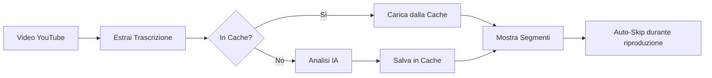

# 🎬 SkipTube AI

Estensione Chrome che usa l'**intelligenza artificiale** per identificare e saltare automaticamente sponsor, intro, outro e autopromozioni nei video YouTube.

## ✨ Caratteristiche

- 🤖 **Analisi IA** - Usa Claude AI o GPT-4 per identificare con precisione i segmenti
- 🎯 **Skip automatico** - Salta automaticamente sponsor, intro, outro, donazioni e autopromo
- 💾 **Cache intelligente** - Analizza ogni video una sola volta, poi usa la cache
- 🌍 **Multilingua** - Funziona con video in italiano, inglese e altre lingue
- 👁️ **Preview** - Mostra anteprima prima di saltare con possibilità di annullare
- 📊 **Marcatori visivi** - Mostra segmenti da saltare sulla timeline del video
- ⚙️ **Personalizzabile** - Scegli quali tipi di contenuti saltare

## ⚠️ Requisiti

**OBBLIGATORIO**: API key Claude AI o OpenAI

L'estensione **non funziona** senza configurazione IA. Vedi [CONFIGURAZIONE_IA.md](CONFIGURAZIONE_IA.md) per istruzioni dettagliate.

## 🚀 Installazione

### 1. Scarica l'estensione

```bash
git clone https://github.com/tuousername/SkipTubeAI.git
cd SkipTubeAI
```

### 2. Configura l'API IA

**Leggi [CONFIGURAZIONE_IA.md](CONFIGURAZIONE_IA.md)** per istruzioni complete.

Riassunto veloce:
1. Ottieni API key da [Claude](https://console.anthropic.com/) o [OpenAI](https://platform.openai.com/)
2. Apri `background.js`
3. Modifica riga 5: `this.API_KEY = 'la-tua-chiave-qui';`

### 3. Carica in Chrome

1. Apri Chrome e vai su `chrome://extensions/`
2. Attiva **Modalità sviluppatore** (interruttore in alto a destra)
3. Clicca **Carica estensione non pacchettizzata**
4. Seleziona la cartella `SkipTubeAI`

## 📖 Utilizzo

### Primo utilizzo:

1. Apri un video YouTube con sottotitoli
2. Il pannello trascrizione si aprirà automaticamente
3. L'estensione analizza il video con IA (richiede ~2-5 secondi)
4. Vedrai una notifica: "✅ Trovati X segmenti da saltare"
5. Durante la riproduzione, i segmenti vengono saltati automaticamente

### Successivi utilizzi:

Grazie alla cache, video già analizzati:
- Caricano i segmenti istantaneamente
- Non consumano API calls
- Funzionano offline (dopo prima analisi)

## ⚙️ Impostazioni

L'estensione salta automaticamente:

- ✅ **Sponsorizzazioni** - Segmenti sponsorizzati nel video
- ✅ **Intro** - Sigla iniziale / introduzione
- ✅ **Outro** - Sigla finale / conclusione
- ✅ **Donazioni** - Ringraziamenti Super Chat / donazioni
- ✅ **Autopromozione** - "Iscriviti", "campanella", merchandise

Puoi personalizzare nelle impostazioni dell'estensione.

## 🎯 Come funziona



### Processo dettagliato:

1. **Estrazione trascrizione**
   - Apre automaticamente il pannello trascrizione
   - Estrae tutti i segmenti dal DOM
   - ~200-400 segmenti per video di 10-20 minuti

2. **Analisi IA**
   - Invia trascrizione a Claude/GPT-4
   - IA identifica sponsor, intro, outro, etc.
   - Restituisce timestamp precisi (es: 1:23 - 1:45)

3. **Caching**
   - Salva risultati in Chrome storage
   - Cache dura 30 giorni
   - Evita costi API ripetuti

4. **Auto-Skip**
   - Monitora tempo di riproduzione
   - Salta automaticamente quando raggiunge un segmento
   - Mostra preview 0.5s prima (configurabile)

## 💰 Costi

### Claude Haiku (Consigliato):
- **~$0.001** per video (10 minuti)
- **~$0.10** per 100 video
- **~$1.00** per 1000 video

### GPT-4o-mini:
- **~$0.0005** per video
- **~$0.05** per 100 video

Grazie alla cache, ogni video viene analizzato **una sola volta**.

## 🐛 Problemi comuni

### "API Key non configurata"
→ Devi configurare l'API in `background.js`. Vedi [CONFIGURAZIONE_IA.md](CONFIGURAZIONE_IA.md)

### "Trascrizione non disponibile"
→ Il video non ha sottotitoli. L'estensione funziona solo con video che hanno trascrizioni.

### "Nessun contenuto da saltare rilevato"
→ L'IA non ha trovato sponsor/intro/outro. Normale per alcuni video.

### Estensione non si carica
→ Controlla errori in `chrome://extensions/` e nella console del service worker

## 📁 Struttura progetto

```
SkipTubeAI/
├── manifest.json          # Configurazione estensione
├── background.js          # Service worker + logica IA
├── content.js            # Script pagina YouTube
├── popup.html            # Popup estensione
├── popup.js              # Logica popup
├── README.md             # Questo file
├── CONFIGURAZIONE_IA.md  # Guida setup IA
└── GUIDA_UTILIZZO.md     # Guida utente dettagliata
```

## 🔒 Privacy & Sicurezza

### Cosa viene inviato all'API IA:
- ✅ Trascrizione del video (solo testo)
- ✅ Titolo del video
- ❌ **NON** invia: cronologia, dati personali, cookie

### Storage locale:
- Segmenti analizzati salvati in `chrome.storage.local`
- Nessun dato inviato a server terzi
- Cache cancellabile dalle impostazioni Chrome

### API Key:
- ⚠️ **Non condividere** la tua API key
- ⚠️ **Non committare** chiavi in repository pubblici
- Usa `.gitignore` se pubblichi il codice

## 🤝 Contribuire

Contributi benvenuti!

1. Fork del repository
2. Crea un branch: `git checkout -b feature/nuova-funzionalita`
3. Commit: `git commit -m 'Aggiunge nuova funzionalità'`
4. Push: `git push origin feature/nuova-funzionalita`
5. Apri una Pull Request

## 📝 Licenza

MIT License - vedi file LICENSE

## 🙏 Credits

- [Anthropic Claude](https://www.anthropic.com/) - IA per analisi
- [OpenAI](https://openai.com/) - IA alternativa
- Ispirato da [SponsorBlock](https://sponsor.ajay.app/)

## 📧 Supporto

- 🐛 **Bug**: Apri issue su GitHub
- 💡 **Suggerimenti**: Discussions su GitHub
- 📧 **Contatto**: [tua email]

---

⭐ Se l'estensione ti è utile, lascia una stella su GitHub!
